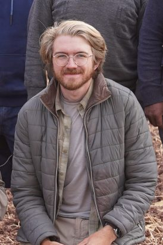

```{r echo=FALSE}

```


Welcome to the newly launched website!
I am currently a 4th year PhD Candidate in the Department of Anthropology at the University of Michigan.

My primary research interests include:

* Emergence of Complex Societies
* Inequality
* Household Archaeology
* Interregional Interaction
* The Intersections of Archaeology and Technology

My dissertation research focuses on understanding the rise and decline of several economic and political centers during the Late Formative (600 BCE - 200 CE) in Cusco, Peru. In particular, I am directing excavations at the site of Muyumoqo, located in the Chit'apampa Basin just north of Cusco. Stay posted for more about this work!

*Small note:* This website is under active construction as I build my online footprint. 
I am currently learning how to build websites using the R package Distill, so I apologize for any hiccups. This website is currently under construction
